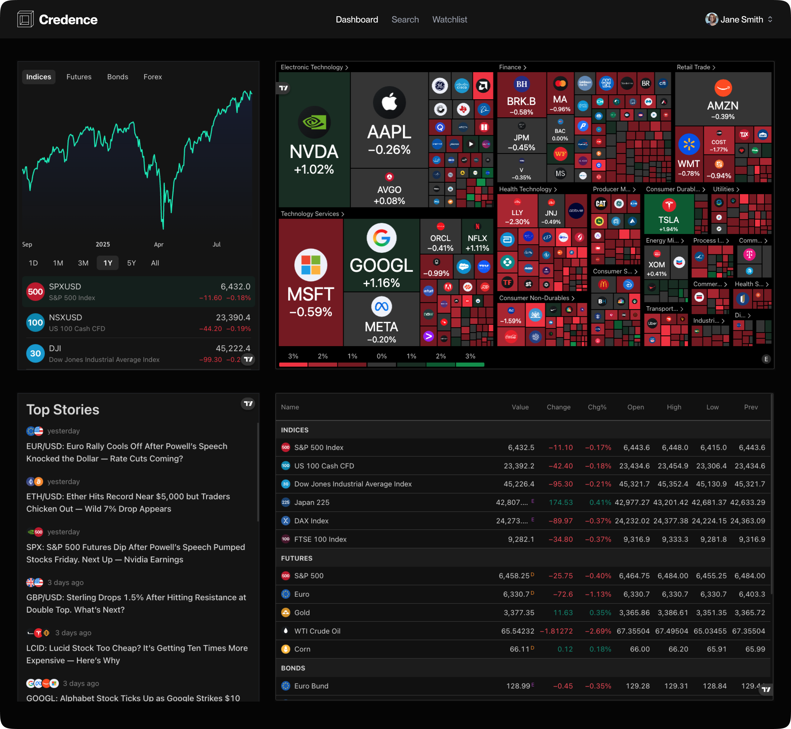

# Credence - Your Ultimate Stock Market Toolkit



Credence is a high-performance, dark-themed financial dashboard built with Next.js 15. It integrates real-time stock data, market heatmaps, and advanced TradingView widgets to provide a premium experience for modern investors.

## Key Features

- **Advanced Market Visualization**: Interactive heatmaps, technical charts, and company profiles powered by TradingView.
- **Smart News Summaries**: Daily AI-curated news summaries and top stories to keep you ahead of the market.
- **Custom Watchlists**: High-density data tables to monitor your portfolio at a glance.
- **Automated Price Alerts**: Responsive monitoring with minute-by-minute alert triggers via Inngest.
- **Premium UI/UX**: A curated dark-mode aesthetic (#050505) with professional typography using Geist Sans.

## Tech Stack

- **Framework**: Next.js 15 (App Router)
- **Styling**: Vanilla CSS and Tailwind components
- **Database**: MongoDB
- **Workflows**: Inngest for background jobs and cron monitoring
- **Data Layer**: Finnhub API and TradingView Embedded Widgets
- **Email**: NodeMailer with Gmail integration

## Getting Started

First, install the dependencies:

```bash
npm install
```

Second, configure your environment variables in a .env file (see .env.example if available).

Finally, run the development server:

```bash
npm run dev
# or
yarn dev
# or
pnpm dev
# or
bun dev
```

Open http://localhost:3000 with your browser to see the result.

---
© 2026 Credence. All rights reserved.
